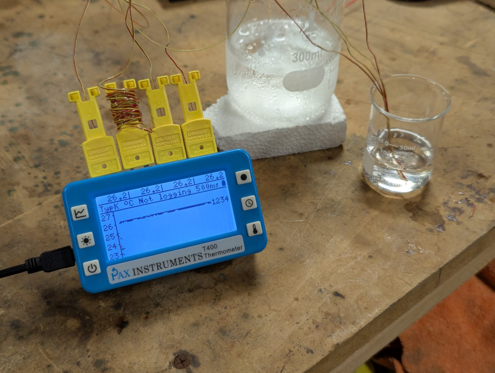
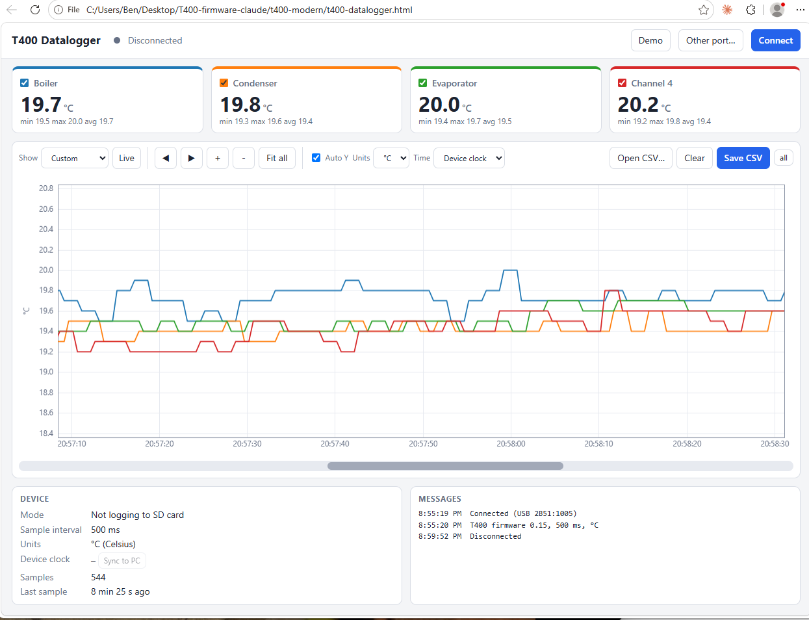

# T400 firmware, modernized for Arduino IDE 2.x

Port of [PaxInstruments/t400-firmware](https://github.com/PaxInstruments/t400-firmware) (v0.15) that builds
in Arduino IDE 2.3.x using only the stock Arduino AVR core and libraries from the Library Manager.
No forked libraries and no forked Arduino core are needed.

Current build (arduino-cli 1.5.1 / AVR core 1.8.8): **28,424 B flash (99%), 2,155 B RAM (84%, 405 B free)**.
The original Pax build was 24,062 B / 2,275 B (285 B free). Flash is the tight resource: RTC support, serial commands,
timestamps and calibration cost about 4.3 kB, which is why the board definition builds with `-mcall-prologues`
(about 800 B saved). Tested on a T400: temperature readings, USB serial, RTC sync, uploads, calibration over serial.
Not yet tested: SD logging with the new row format, the LCD after the string/table changes, and the calibration
button gesture (see "Calibration" below).

## Setup
1. Boards Manager: install **Arduino AVR Boards**.
2. Copy `hardware/PaxInstruments` into your sketchbook's `hardware` folder
   (`Documents/Arduino/hardware/PaxInstruments/avr/boards.txt`). Restart the IDE.
3. Library Manager, install:
   | Library | Version | Replaces |
   |---|---|---|
   | U8glib (Oliver Kraus) | 1.19.1 | Pax-U8glib fork |
   | MCP342x (Steve Marple) | 1.0.4 | MCP3424 (Pax) |
   | MCP9800 (Jack Christensen) | 2.1.0 | MCP980X (Pax, same author, renamed) |
   | ds3231 | nothing | 3 lines of `Wire` in `setup()` |
   | SdFat | nothing to install | the 2014-11-11 SdFat is bundled in `t400/src/SdFat/` (see below) |
4. Open `t400/t400.ino`, choose **Tools > Board > Pax Instruments T400**, upload.
   To enter the bootloader: power off, hold graph + backlight, press power (as in the original README).

## What changed vs. the original
- `boards.txt` re-uses the stock `arduino:avr` core + `leonardo` variant (the T400 pin map is identical),
  at 8 MHz with the T400 USB VID/PID. It also sets `TWI_BUFFER_LENGTH=8` (gives back 72 B of RAM) and `-mcall-prologues` (saves about 800 B of flash;
  without it the firmware does not fit). Re-copy the whole `hardware/PaxInstruments` folder into your sketchbook whenever it changes.
  There is intentionally no bootloader entry; do not "Burn Bootloader" with a Leonardo one.
- **Power latch (important):** `hardware/.../variants/T400/pins_arduino.h` is the Leonardo pin map with the TX/RX LED
  macros removed. On the T400, PD5 is the power latch (high = board off), and the stock Leonardo variant makes the USB
  core toggle that pin on every USB transfer, which switches the board off a few seconds after USB serial activity.
  `Power::setup()` also now holds the latch low itself instead of relying on the bootloader.
- `u8g_dev_st7567_pi13264.c`: the Pax LCD driver, the only thing the Pax U8glib fork added to U8glib.
  Kept in the sketch so stock U8glib can be used.
- `fmt.h`: replaces `sprintf` (drops `vfprintf`, about 1 kB flash).
- `t400.ino`: ADC wrapper over MCP342x, RTC setup by raw I2C write, and a bug fix (below).

## Uploading and the bootloader
Normal uploads from the IDE work without the button method: the IDE opens the port at 1200 baud, the sketch lets
its watchdog expire, and the T400 bootloader takes over. This sketch now stops feeding the watchdog during that
request (a sketch that never lets it expire, like the original and earlier builds of this port, blocks the auto-reset).
If a upload ever fails, or the sketch is hung, use the manual method: power off, hold D (graph) + E (backlight),
press power. The bootloader stays active while those two are held at power-on.
The first upload of this version onto a board running an older build may still need the manual method.

### Recommended: tools/upload.ps1
The bootloader quits after about 16 s (its timer is tuned for 16 MHz but the T400 runs at 8 MHz), so entering
bootloader mode and *then* clicking Upload can lose the race while the IDE compiles. `tools/upload.ps1` compiles
first, then reboots the board into the bootloader (or waits for the manual button method) and flashes at once,
retrying if needed:

    powershell -ExecutionPolicy Bypass -File tools/upload.ps1

## Calibration (0 C ice bath)
Single-point calibration for each thermocouple channel:
1. Put every probe you want calibrated in a well-stirred crushed ice and water bath and let it settle for a minute or two.
2. **Hold the units button (C) for 5 seconds.** At 1 s the screen says "Keep holding to calibrate". At 5 s it says
   "Calibrating (0C ice bath)" for about 4 seconds (16 readings per channel), then shows the outcome for 6 seconds:
   `Cal 1:ok 2:ok 3:?? 4:--` where `ok` = calibrated, `--` = no probe attached, `??` = rejected, offset unchanged.
   (A quick press still cycles the units, now on release. Releasing between 1 and 5 s does nothing.)
3. Each calibrated channel now reads 0.0 in the bath. The offset is stored in EEPROM and survives power loss and re-flashing.

How it works: a channel counts as attached if every reading was valid. For an attached channel the stable average of its
cold-junction-compensated voltage is turned into an offset in microvolts (the physically right correction, since it is an
input offset) and added to that channel from then on. Channels that are not attached keep their previous offset. A channel is
rejected, and keeps its previous offset, if its readings varied by more than about 2 C during the run, or are more than
about 6 C from 0 C (i.e. the probe is not really in an ice bath). Calibration is refused while logging.

The ADC resolves 7.8 uV, about 0.19 C per count, so a calibrated channel in the bath can still flicker by a couple of
tenths of a degree; the offset removes the systematic error, not that noise. The offset is a fixed voltage, so it is exact at
0 C and a good approximation elsewhere. It also absorbs any error in the cold-junction sensor at the temperature of the
calibration. Calibrate at roughly the temperature the unit will be used at.

Serial commands (any serial terminal at 9600 baud, line ending Newline): `C?` show the offsets in uV, `C0` clear them all,
`C!` start a calibration run exactly as the button does (progress and result print as `CAL 1:ok(-39) 2:ok(-91) 3:-- 4:??`).
`diagnostics/cal_test` checks the calibration logic on the device (21 cases, all pass) and restores your stored offsets.

## Live data and the datalogger web app
The T400 streams every sample over USB serial (9600 baud) whether or not it is logging to the SD card. The sample rate is the
interval chosen with the front-panel buttons, units follow the units button, and starting/stopping logging (or changing the
interval or units) restarts the elapsed column, exactly as in the SD log. Lines (text, one per line):

    331.5, 2026-10-04 20:33:36.5, 20.8, 20.8, 21.0, -      sample: elapsed, timestamp, ch1..ch4 (- = no probe)
    S,0.15,C,0,LD0003.CSV                                   status: version, unit C/F/K, interval seconds (0 = 500 ms), log file or -
    OK ... / ERR ... / CAL ...                              replies to commands

The status line is sent on request and whenever the unit, interval or logging state changes. Commands: `H` status, `T<YYYY-MM-DD
HH:MM:SS>` set the clock, `T?` read it, `C?` / `C0` / `C!` calibration (see above).

**`t400-datalogger.html`** is a single-file web app (no installation, no internet needed) that connects to the T400 using the
Web Serial API, so it needs **Chrome or Edge**. Open it by double-clicking, or, if your browser refuses Web Serial on a `file://` page,
run `python -m http.server` in this folder and open http://localhost:8000/t400-datalogger.html. Close the Arduino Serial Monitor first
(only one program can use the port).
- **Connect** picks the T400 (USB id 2B51); it reconnects by itself when the T400 is unplugged and replugged, and next time the page opens.
  "Other port..." lists every serial port. **Demo** feeds simulated readings through the same code so you can try the interface.
- Cards show the latest value of each channel with min/max/average over the visible range; the checkbox shows or hides a channel.
  The channel name on each card is a text box: click it to rename the channel (up to 24 characters; Enter keeps it, Escape cancels,
  an empty name goes back to "Channel N"). Names are remembered by the browser, appear in the chart tooltip, and head the CSV columns
  ("Oven top (°C)"). Opening a CSV saved by this page brings its channel names back.
- The chart plots all channels. Zoom with the mouse wheel (or + / - / the Show menu), scroll by dragging the chart or the bar below it
  (or the arrow buttons / arrow keys), **Live** follows the newest data, **Fit all** (or double-click) shows everything.
  Hover for exact values. Dashed markers show log start/stop and unit/interval changes. Auto Y can be turned off (then Shift+wheel
  zooms and dragging pans the Y axis).
- **Units** and **Time** (device clock or PC clock) are display choices. The device's own unit changes are converted automatically.
- **Save CSV** writes exactly the samples in the visible time range (**all** writes everything). **Clear** deletes the collected data.
  Columns: PC time, Device clock, Elapsed (s), Ch1..Ch4 in the chosen unit. Up to 500,000 samples are kept in memory.
- **Sync to PC** sets the T400's clock; the Device panel shows whether it agrees with the PC.
- **Open CSV...** (or drop a file onto the page) displays a log recorded by the T400 and copied from its SD card, or a CSV saved by this
  page. The whole file is shown ("Fit all"), and everything above works on it: zoom, scroll, hover, units, Save CSV of the visible
  range. While a file is open, live data is paused and a blue bar says so; **Close file** (or Clear) returns to live data.
  It understands the current format (`time (s), timestamp, temp_0 (C), ...`), older firmware files with no timestamp column, and files
  from a T400 whose clock was never set (`unset`). Without timestamps the times are estimated from the file's last-modified date and
  the elapsed column, and a note says so. The unit comes from the header (`(C)`, `(F)`, `(K)`). Repeated headers and damaged lines are
  skipped and counted; a file with no temperature columns is rejected with an explanation. A 24-hour log at 500 ms (170,000 rows) loads in
  about half a second.

## Memory
RAM was the constraint that shaped this port (the ATmega32U4 has 2.5 kB). Fixed costs: the graph buffer (800 B), the SD
cache (512 B), the LCD page buffer (132 B), USB and I2C buffers. To keep a safe stack margin:
- String literals for the LCD, serial and SD header use flash (`drawStrP`, `F()`, `PSTR`) instead of RAM.
- Small constant tables (`logIntervals`, `temperatureChannels`, the button tables, the LCD line table) are in flash.
- A CSV row is sent in small pieces (`emit()` in `t400.ino`, `sd::write` / `sd::endRow`) instead of one 72 byte buffer.
Static worst-case stack (call-graph analysis of the build) is about 207 B against 462 B free, versus about 156 B / 285 B
for the original.

## Real-time clock and timestamps
Every serial line and CSV row now has a timestamp column after the elapsed time:
`0, 2026-10-04 19:32:35.5, 27.3, 28.0, 27.2, 27.9`. The fraction is `.0` for the sample taken on the RTC's tick
and `.5` for the half-second sample. If the clock has never been set, the column says `unset`.

The clock is set to the PC's local time (the DS3231 has no time zone or DST handling):
- **Automatically after every upload** by `tools/upload.ps1` (skip with `-NoTimeSync`).
- **Any time** with `powershell -ExecutionPolicy Bypass -File tools/set-time.ps1` (`-Query` just reads it). It waits
  for the PC's next whole second before sending, so it is typically accurate to tens of milliseconds.
- **From the Arduino Serial Monitor** (Newline line ending): send `T2026-10-04 12:34:56` to set, `T?` to read.
  The firmware answers `OK <time>` or `ERR format|range|logging`. It refuses to change the time while logging.

If you upload from the IDE's Upload button instead of `upload.ps1`, run `set-time.ps1` afterwards.

## Diagnostics
`diagnostics/adc_diag` prints an I2C scan, the ambient sensor and raw ADC reads over USB serial, for debugging
missing thermocouple readings.

## Bundled SdFat
`t400/src/SdFat/` is the SdFat 20141111 snapshot from the Pax repo, with only the `#include <...>` lines
changed to relative quoted includes so it builds as part of the sketch. It is private to this sketch: it does not
touch, and is not affected by, any SdFat or SD library you install for other projects.
Modern SdFat (1.x or 2.x) builds but uses far more stack and RAM, which is not safe on this chip
(static worst-case stack: about 156 B here vs about 310 B with SdFat 1.1.4, against about 300 B free RAM).

## Bugs fixed in the original source
`readTemperatures()` never assigned `measuredVoltageUv` on the live (integer) calibration path, so the
calibrated ADC value was dropped (undefined behaviour). It is now assigned from `tmpint32`.
Also: the cold-junction voltage function used the wrong scale in 16-bit arithmetic (every reading about 100 C too high); it is rewritten.
Also: the log time was printed with `%d` for a `uint32_t` (wrapped negative after 32,768 s); it now prints unsigned.
Also: the ambient (cold junction) temperature was truncated to whole degrees, so every reading was up to 1 C low
(about 0.5 C on average); it now keeps 0.1 C resolution.
Also: Fahrenheit conversion overflowed 16 bit math above about 182 C; it now uses 32 bit math.
Also: temperatures between -0.9 and 0 C lost their minus sign on the LCD and in the CSV; fixed (`fmtTenths` in `fmt.h`).
Also: CSV rows were always in Celsius even when the header said (F) or (K); rows now use the selected unit.
Also: the temperature table interpolation truncated instead of rounding, biasing every reading about 0.05 C low and making values
just below a table point read a full 0.1 C low; it now rounds to the nearest 0.1 C.
Also: an open or saturated ADC input could overflow the calibration arithmetic and occasionally produce a plausible-looking
temperature; saturated readings are now treated as out of range before any arithmetic.
Also: variables shared with interrupt handlers are now `volatile`, and the 32 bit elapsed-time read is atomic.
Also: the elapsed-time column stayed at 0 in the default 500 ms mode (the counter only ran in whole-second modes).
Elapsed time is now computed from the RTC (in tenths of a second) relative to the first sample after a reset, so it always
agrees with the timestamp column and cannot be inflated by stray interrupts on the RTC pin. It is 0 at the first sample
after boot or after any reset (start/stop logging, interval or unit change, or setting the clock), and shows `12.0` /
`12.5` in 500 ms mode and plain `12` in whole-second modes. If the clock has never been set it falls back to counting
RTC ticks.
`diagnostics/format_test` checks the formatting and unit conversion code on the device (28 cases including the date arithmetic, all pass).

## Why not U8g2 / SdFat 2.x?
U8g2 costs about +270 B RAM, and modern SdFat adds much more flash and a much deeper call stack.
With 2.5 kB of RAM that leaves no stack headroom while logging.
